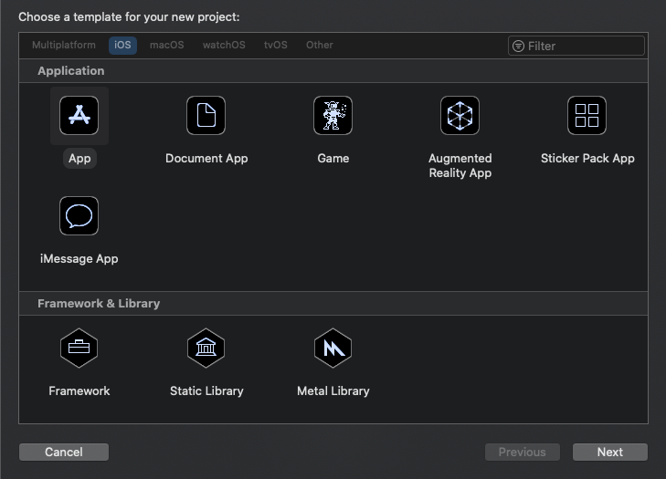
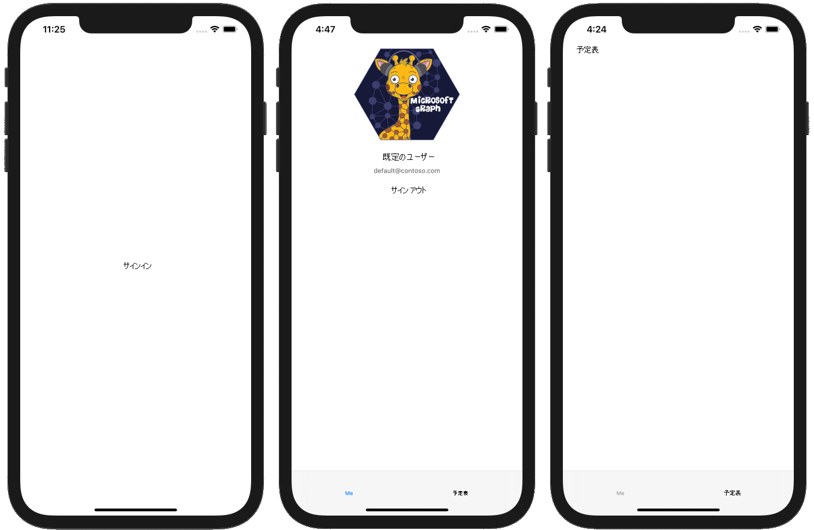

<!-- markdownlint-disable MD002 MD041 -->

<span data-ttu-id="ee1c1-101">最初に、新しい Swift プロジェクトを作成します。</span><span class="sxs-lookup"><span data-stu-id="ee1c1-101">Begin by creating a new Swift project.</span></span>

1. <span data-ttu-id="ee1c1-102">Xcode を開きます。</span><span class="sxs-lookup"><span data-stu-id="ee1c1-102">Open Xcode.</span></span> <span data-ttu-id="ee1c1-103">[**ファイル**] メニューの [**新規作成**]、[**プロジェクト**] の順に選択します。</span><span class="sxs-lookup"><span data-stu-id="ee1c1-103">On the **File** menu, select **New**, then **Project**.</span></span>
1. <span data-ttu-id="ee1c1-104">[**単一ビューアプリ**] テンプレートを選択し、[**次へ**] を選択します。</span><span class="sxs-lookup"><span data-stu-id="ee1c1-104">Choose the **Single View App** template and select **Next**.</span></span>

    

1. <span data-ttu-id="ee1c1-106">**製品名** `GraphTutorial`と**言語**を**Swift**に設定します。</span><span class="sxs-lookup"><span data-stu-id="ee1c1-106">Set the **Product Name** to `GraphTutorial` and the **Language** to **Swift**.</span></span>
1. <span data-ttu-id="ee1c1-107">残りのフィールドに入力し、[**次へ**] を選択します。</span><span class="sxs-lookup"><span data-stu-id="ee1c1-107">Fill in the remaining fields and select **Next**.</span></span>
1. <span data-ttu-id="ee1c1-108">プロジェクトの場所を選択して、[**作成**] を選択します。</span><span class="sxs-lookup"><span data-stu-id="ee1c1-108">Choose a location for the project and select **Create**.</span></span>

## <a name="install-dependencies"></a><span data-ttu-id="ee1c1-109">依存関係のインストール</span><span class="sxs-lookup"><span data-stu-id="ee1c1-109">Install dependencies</span></span>

<span data-ttu-id="ee1c1-110">に進む前に、後で使用する追加の依存関係をインストールします。</span><span class="sxs-lookup"><span data-stu-id="ee1c1-110">Before moving on, install some additional dependencies that you will use later.</span></span>

- <span data-ttu-id="ee1c1-111">Azure AD での認証については、 [Microsoft Authentication Library (MSAL) For iOS](https://github.com/AzureAD/microsoft-authentication-library-for-objc)を使用してください。</span><span class="sxs-lookup"><span data-stu-id="ee1c1-111">[Microsoft Authentication Library (MSAL) for iOS](https://github.com/AzureAD/microsoft-authentication-library-for-objc) for authenticating to with Azure AD.</span></span>
- <span data-ttu-id="ee1c1-112">Microsoft Graph SDK を使用して MSAL を接続する[ための Msal 認証プロバイダー](https://github.com/microsoftgraph/msgraph-sdk-objc-auth) 。</span><span class="sxs-lookup"><span data-stu-id="ee1c1-112">[MSAL Authentication Provider for Objective C](https://github.com/microsoftgraph/msgraph-sdk-objc-auth) to connect MSAL with the Microsoft Graph SDK.</span></span>
- <span data-ttu-id="ee1c1-113">Microsoft graph に電話をかけるための[Microsoft GRAPH SDK For 客観 C](https://github.com/microsoftgraph/msgraph-sdk-objc) 。</span><span class="sxs-lookup"><span data-stu-id="ee1c1-113">[Microsoft Graph SDK for Objective C](https://github.com/microsoftgraph/msgraph-sdk-objc) for making calls to Microsoft Graph.</span></span>
- <span data-ttu-id="ee1c1-114">Microsoft Graph では、ユーザーやイベントなどの Microsoft Graph のリソースを表す、厳密に型指定されたオブジェクト用の[Microsoft Graph モデル SDK を目的](https://github.com/microsoftgraph/msgraph-sdk-objc-models)としています。</span><span class="sxs-lookup"><span data-stu-id="ee1c1-114">[Microsoft Graph Models SDK for Objective C](https://github.com/microsoftgraph/msgraph-sdk-objc-models) for strongly-typed objects representing Microsoft Graph resources like users or events.</span></span>

1. <span data-ttu-id="ee1c1-115">Xcode を終了します。</span><span class="sxs-lookup"><span data-stu-id="ee1c1-115">Quit Xcode.</span></span>
1. <span data-ttu-id="ee1c1-116">ターミナルを開き、グラフのディレクトリを**Graphtutorial**プロジェクトの場所に変更します。</span><span class="sxs-lookup"><span data-stu-id="ee1c1-116">Open Terminal and change the directory to the location of your **GraphTutorial** project.</span></span>
1. <span data-ttu-id="ee1c1-117">Podfile を作成するには、次のコマンドを実行します。</span><span class="sxs-lookup"><span data-stu-id="ee1c1-117">Run the following command to create a Podfile.</span></span>

    ```Shell
    pod init
    ```

1. <span data-ttu-id="ee1c1-118">Podfile を開き、行の`use_frameworks!`直後に次の行を追加します。</span><span class="sxs-lookup"><span data-stu-id="ee1c1-118">Open the Podfile and add the following lines just after the `use_frameworks!` line.</span></span>

    ```Ruby
    pod 'MSAL', '~> 0.3.0'
    pod 'MSGraphMSALAuthProvider', '~> 0.1.1'
    pod 'MSGraphClientSDK', ' ~> 0.1.3'
    pod 'MSGraphClientModels', '~> 0.1.1'
    ```

1. <span data-ttu-id="ee1c1-119">Podfile を保存してから、次のコマンドを実行して依存関係をインストールします。</span><span class="sxs-lookup"><span data-stu-id="ee1c1-119">Save the Podfile, then run the following command to install the dependencies.</span></span>

    ```Shell
    pod install
    ```

1. <span data-ttu-id="ee1c1-120">コマンドが完了したら、Xcode で新しく作成した**graphtutorial**を開きます。</span><span class="sxs-lookup"><span data-stu-id="ee1c1-120">Once the command completes, open the newly created **GraphTutorial.xcworkspace** in Xcode.</span></span>

## <a name="design-the-app"></a><span data-ttu-id="ee1c1-121">アプリを設計する</span><span class="sxs-lookup"><span data-stu-id="ee1c1-121">Design the app</span></span>

<span data-ttu-id="ee1c1-122">このセクションでは、アプリのビュー (サインインページ、タブバーナビゲーター、ウェルカムページ、予定表ページ) を作成します。</span><span class="sxs-lookup"><span data-stu-id="ee1c1-122">In this section you will create the views for the app: a sign in page, a tab bar navigator, a welcome page, and a calendar page.</span></span> <span data-ttu-id="ee1c1-123">また、アクティビティインジケーターオーバーレイも作成します。</span><span class="sxs-lookup"><span data-stu-id="ee1c1-123">You'll also create an activity indicator overlay.</span></span>

### <a name="create-sign-in-page"></a><span data-ttu-id="ee1c1-124">サインインページの作成</span><span class="sxs-lookup"><span data-stu-id="ee1c1-124">Create sign in page</span></span>

1. <span data-ttu-id="ee1c1-125">Xcode の**Graphtutorial**フォルダーを展開し、[ **viewcontroller. swift**] を選択します。</span><span class="sxs-lookup"><span data-stu-id="ee1c1-125">Expand the **GraphTutorial** folder in Xcode, then select **ViewController.swift**.</span></span>
1. <span data-ttu-id="ee1c1-126">**ファイルインスペクター**で、ファイルの**名前**をに`SignInViewController.swift`変更します。</span><span class="sxs-lookup"><span data-stu-id="ee1c1-126">In the **File Inspector**, change the **Name** of the file to `SignInViewController.swift`.</span></span>

    

1. <span data-ttu-id="ee1c1-128">**SignInViewController**を開き、そのコンテンツを次のコードに置き換えます。</span><span class="sxs-lookup"><span data-stu-id="ee1c1-128">Open **SignInViewController.swift** and replace its contents with the following code.</span></span>

    ```Swift
    import UIKit

    class SignInViewController: UIViewController {

        override func viewDidLoad() {
            super.viewDidLoad()
            // Do any additional setup after loading the view.
        }

        @IBAction func signIn() {
            self.performSegue(withIdentifier: "userSignedIn", sender: nil)
        }
    }
    ```

1. <span data-ttu-id="ee1c1-129">メインの**ストーリーボード**ファイルを開きます。</span><span class="sxs-lookup"><span data-stu-id="ee1c1-129">Open the **Main.storyboard** file.</span></span>
1. <span data-ttu-id="ee1c1-130">[**ビューコントローラーシーン**] を展開し、[**ビューコントローラー**] を選択します。</span><span class="sxs-lookup"><span data-stu-id="ee1c1-130">Expand **View Controller Scene**, then select **View Controller**.</span></span>

    

1. <span data-ttu-id="ee1c1-132">[ **Identity Inspector**] を選択してから、**クラス**のドロップダウンを**SignInViewController**に変更します。</span><span class="sxs-lookup"><span data-stu-id="ee1c1-132">Select the **Identity Inspector**, then change the **Class** dropdown to **SignInViewController**.</span></span>

    

1. <span data-ttu-id="ee1c1-134">**ライブラリ**を選択し、**ボタン**を [サインイン]**ビューコントローラー**にドラッグします。</span><span class="sxs-lookup"><span data-stu-id="ee1c1-134">Select the **Library**, then drag a **Button** onto the **Sign In View Controller**.</span></span>

    

1. <span data-ttu-id="ee1c1-136">ボタンを選択した状態で、[ **Attributes Inspector** ] \*\*\*\* を選択し、ボタン`Sign In`のタイトルをに変更します。</span><span class="sxs-lookup"><span data-stu-id="ee1c1-136">With the button selected, select the **Attributes Inspector** and change the **Title** of the button to `Sign In`.</span></span>

    

1. <span data-ttu-id="ee1c1-138">**サインインビューコントローラー**を選択し、[**接続インスペクター**] を選択します。</span><span class="sxs-lookup"><span data-stu-id="ee1c1-138">Select the **Sign In View Controller**, then select the **Connections Inspector**.</span></span>
1. <span data-ttu-id="ee1c1-139">[**受信した処理**] で、[**サインイン**] の隣にある円をボタンにドラッグします。</span><span class="sxs-lookup"><span data-stu-id="ee1c1-139">Under **Received Actions**, drag the unfilled circle next to **signIn** onto the button.</span></span> <span data-ttu-id="ee1c1-140">ポップアップメニューで [ **Touch Up** ] を選択します。</span><span class="sxs-lookup"><span data-stu-id="ee1c1-140">Select **Touch Up Inside** on the pop-up menu.</span></span>

    

1. <span data-ttu-id="ee1c1-142">[**エディター** ] メニューの [**自動レイアウトの問題を解決**する] を選択し、[すべてのビューの下**にある**[不足している**制約の追加**] を選択します。</span><span class="sxs-lookup"><span data-stu-id="ee1c1-142">On the **Editor** menu, select **Resolve Auto Layout Issues**, then select **Add Missing Constraints** underneath **All Views in Sign In View Controller**.</span></span>

### <a name="create-tab-bar"></a><span data-ttu-id="ee1c1-143">タブバーを作成する</span><span class="sxs-lookup"><span data-stu-id="ee1c1-143">Create tab bar</span></span>

1. <span data-ttu-id="ee1c1-144">**ライブラリ**を選択し、**タブバーコントローラー**をストーリーボードにドラッグします。</span><span class="sxs-lookup"><span data-stu-id="ee1c1-144">Select the **Library**, then drag a **Tab Bar Controller** onto the storyboard.</span></span>
1. <span data-ttu-id="ee1c1-145">**サインインビューコントローラー**を選択し、[**接続インスペクター**] を選択します。</span><span class="sxs-lookup"><span data-stu-id="ee1c1-145">Select the **Sign In View Controller**, then select the **Connections Inspector**.</span></span>
1. <span data-ttu-id="ee1c1-146">[**トリガー**された Segues] で、[**手動**] の横にある円を、ストーリーボードの**タブバーコントローラー**にドラッグします。</span><span class="sxs-lookup"><span data-stu-id="ee1c1-146">Under **Triggered Segues**, drag the unfilled circle next to **manual** onto the **Tab Bar Controller** on the storyboard.</span></span> <span data-ttu-id="ee1c1-147">ポップアップメニューの [**モーダル**] を選択します。</span><span class="sxs-lookup"><span data-stu-id="ee1c1-147">Select **Present Modally** in the pop-up menu.</span></span>

    

1. <span data-ttu-id="ee1c1-149">追加した segue を選択し、[ **Attributes Inspector**] を選択します。</span><span class="sxs-lookup"><span data-stu-id="ee1c1-149">Select the segue you just added, then select the **Attributes Inspector**.</span></span> <span data-ttu-id="ee1c1-150">[**識別子**] フィールドを`userSignedIn`に設定します。</span><span class="sxs-lookup"><span data-stu-id="ee1c1-150">Set the **Identifier** field to `userSignedIn`.</span></span>

    

1. <span data-ttu-id="ee1c1-152">**アイテム1のシーン**を選択し、[**接続インスペクター**] を選択します。</span><span class="sxs-lookup"><span data-stu-id="ee1c1-152">Select the **Item 1 Scene**, then select the **Connections Inspector**.</span></span>
1. <span data-ttu-id="ee1c1-153">[**トリガー**された Segues] で、[**手動**] の横にある円を、ストーリーボードの**サインインビューコントローラー**にドラッグします。</span><span class="sxs-lookup"><span data-stu-id="ee1c1-153">Under **Triggered Segues**, drag the unfilled circle next to **manual** onto the **Sign In View Controller** on the storyboard.</span></span> <span data-ttu-id="ee1c1-154">ポップアップメニューの [**モーダル**] を選択します。</span><span class="sxs-lookup"><span data-stu-id="ee1c1-154">Select **Present Modally** in the pop-up menu.</span></span>
1. <span data-ttu-id="ee1c1-155">追加した segue を選択し、[ **Attributes Inspector**] を選択します。</span><span class="sxs-lookup"><span data-stu-id="ee1c1-155">Select the segue you just added, then select the **Attributes Inspector**.</span></span> <span data-ttu-id="ee1c1-156">[**識別子**] フィールドを`userSignedOut`に設定します。</span><span class="sxs-lookup"><span data-stu-id="ee1c1-156">Set the **Identifier** field to `userSignedOut`.</span></span>

### <a name="create-welcome-page"></a><span data-ttu-id="ee1c1-157">ウェルカムページを作成する</span><span class="sxs-lookup"><span data-stu-id="ee1c1-157">Create welcome page</span></span>

1. <span data-ttu-id="ee1c1-158">[ **Assets] セット**ファイルを選択します。</span><span class="sxs-lookup"><span data-stu-id="ee1c1-158">Select the **Assets.xcassets** file.</span></span>
1. <span data-ttu-id="ee1c1-159">[**エディター** ] メニューの [**アセットの追加**] を選択し、[**新しいイメージセット**] を選択します。</span><span class="sxs-lookup"><span data-stu-id="ee1c1-159">On the **Editor** menu, select **Add Assets**, then **New Image Set**.</span></span>
1. <span data-ttu-id="ee1c1-160">新しい**画像**アセットを選択し、**属性インスペクター**を使用してその**名前**をに`DefaultUserPhoto`設定します。</span><span class="sxs-lookup"><span data-stu-id="ee1c1-160">Select the new **Image** asset and use the **Attribute Inspector** to set its **Name** to `DefaultUserPhoto`.</span></span>
1. <span data-ttu-id="ee1c1-161">既定のユーザープロファイル写真として機能する任意のイメージを追加します。</span><span class="sxs-lookup"><span data-stu-id="ee1c1-161">Add any image you like to serve as a default user profile photo.</span></span>

    

1. <span data-ttu-id="ee1c1-163">という名前`WelcomeViewController`の**graphtutorial**フォルダーに、新しい**cocoa タッチクラス**ファイルを作成します。</span><span class="sxs-lookup"><span data-stu-id="ee1c1-163">Create a new **Cocoa Touch Class** file in the **GraphTutorial** folder named `WelcomeViewController`.</span></span> <span data-ttu-id="ee1c1-164">Field**のサブクラス**で [ **uiviewcontroller** ] を選択します。</span><span class="sxs-lookup"><span data-stu-id="ee1c1-164">Choose **UIViewController** in the **Subclass of** field.</span></span>
1. <span data-ttu-id="ee1c1-165">**WelcomeViewController**を開き、そのコンテンツを次のコードに置き換えます。</span><span class="sxs-lookup"><span data-stu-id="ee1c1-165">Open **WelcomeViewController.swift** and replace its contents with the following code.</span></span>

    ```Swift
    import UIKit

    class WelcomeViewController: UIViewController {

        @IBOutlet var userProfilePhoto: UIImageView!
        @IBOutlet var userDisplayName: UILabel!
        @IBOutlet var userEmail: UILabel!

        override func viewDidLoad() {
            super.viewDidLoad()

            // Do any additional setup after loading the view.

            // TEMPORARY
            self.userProfilePhoto.image = UIImage(imageLiteralResourceName: "DefaultUserPhoto")
            self.userDisplayName.text = "Default User"
            self.userEmail.text = "default@contoso.com"
        }

        @IBAction func signOut() {
            self.performSegue(withIdentifier: "userSignedOut", sender: nil)
        }
    }
    ```

1. <span data-ttu-id="ee1c1-166">**メインのストーリーボード**を開きます。</span><span class="sxs-lookup"><span data-stu-id="ee1c1-166">Open **Main.storyboard**.</span></span> <span data-ttu-id="ee1c1-167">**アイテム1のシーン**を選択し、[ **id インスペクター**] を選択します。</span><span class="sxs-lookup"><span data-stu-id="ee1c1-167">Select the **Item 1 Scene**, then select the **Identity Inspector**.</span></span> <span data-ttu-id="ee1c1-168">**クラス**値を**WelcomeViewController**に変更します。</span><span class="sxs-lookup"><span data-stu-id="ee1c1-168">Change the **Class** value to **WelcomeViewController**.</span></span>
1. <span data-ttu-id="ee1c1-169">**ライブラリ**を使用して、次のアイテムを**アイテム1のシーン**に追加します。</span><span class="sxs-lookup"><span data-stu-id="ee1c1-169">Using the **Library**, add the following items to the **Item 1 Scene**.</span></span>

    - <span data-ttu-id="ee1c1-170">1つの**イメージビュー**</span><span class="sxs-lookup"><span data-stu-id="ee1c1-170">One **Image View**</span></span>
    - <span data-ttu-id="ee1c1-171">2つの**ラベル**</span><span class="sxs-lookup"><span data-stu-id="ee1c1-171">Two **Labels**</span></span>
    - <span data-ttu-id="ee1c1-172">1つの**ボタン**</span><span class="sxs-lookup"><span data-stu-id="ee1c1-172">One **Button**</span></span>

1. <span data-ttu-id="ee1c1-173">イメージビューを選択し、**サイズインスペクター**を選択します。</span><span class="sxs-lookup"><span data-stu-id="ee1c1-173">Select the image view, then select the **Size Inspector**.</span></span>
1. <span data-ttu-id="ee1c1-174">**幅**と**高さ**を196に設定します。</span><span class="sxs-lookup"><span data-stu-id="ee1c1-174">Set the **Width** and **Height** to 196.</span></span>
1. <span data-ttu-id="ee1c1-175">2番目のラベルを選択し、[ **Attributes インスペクター**] を選択します。</span><span class="sxs-lookup"><span data-stu-id="ee1c1-175">Select the second label, then select the **Attributes Inspector**.</span></span>
1. <span data-ttu-id="ee1c1-176">**色**を**濃い灰色の色**に変更し、**フォント**を**システム 12.0**に変更します。</span><span class="sxs-lookup"><span data-stu-id="ee1c1-176">Change the **Color** to **Dark Gray Color**, and change the **Font** to **System 12.0**.</span></span>
1. <span data-ttu-id="ee1c1-177">ボタンを選択し、[ **Attributes Inspector**] を選択します。</span><span class="sxs-lookup"><span data-stu-id="ee1c1-177">Select the button, then select the **Attributes Inspector**.</span></span>
1. <span data-ttu-id="ee1c1-178">**タイトル**をに`Sign Out`変更します。</span><span class="sxs-lookup"><span data-stu-id="ee1c1-178">Change the **Title** to `Sign Out`.</span></span>
1. <span data-ttu-id="ee1c1-179">[**接続インスペクター**] を使用して、次の接続を行います。</span><span class="sxs-lookup"><span data-stu-id="ee1c1-179">Using the **Connections Inspector**, make the following connections.</span></span>

    - <span data-ttu-id="ee1c1-180">**Userdisplayname**アウトレットを最初のラベルにリンクします。</span><span class="sxs-lookup"><span data-stu-id="ee1c1-180">Link the **userDisplayName** outlet to the first label.</span></span>
    - <span data-ttu-id="ee1c1-181">**Useremail**アウトレットを2番目のラベルにリンクします。</span><span class="sxs-lookup"><span data-stu-id="ee1c1-181">Link the **userEmail** outlet to the second label.</span></span>
    - <span data-ttu-id="ee1c1-182">**UserProfilePhoto**アウトレットをイメージビューにリンクします。</span><span class="sxs-lookup"><span data-stu-id="ee1c1-182">Link the **userProfilePhoto** outlet to the image view.</span></span>
    - <span data-ttu-id="ee1c1-183">**SignOut** received アクションをボタンの**タッチアップ**にリンクします。</span><span class="sxs-lookup"><span data-stu-id="ee1c1-183">Link the **signOut** received action to the button's **Touch Up Inside**.</span></span>

1. <span data-ttu-id="ee1c1-184">シーンの下部にあるタブバー項目を選択し、[ **Attributes Inspector**] を選択します。</span><span class="sxs-lookup"><span data-stu-id="ee1c1-184">Select the tab bar item at the bottom of the scene, then select the **Attributes Inspector**.</span></span> <span data-ttu-id="ee1c1-185">**タイトル**をに`Me`変更します。</span><span class="sxs-lookup"><span data-stu-id="ee1c1-185">Change the **Title** to `Me`.</span></span>
1. <span data-ttu-id="ee1c1-186">[**エディター** ] メニューの [**自動レイアウトの問題を解決**する] を選択し、[**ウェルカムビューコントローラーのすべてのビューの**下にある [不足している制約を**追加**する] を選択します。</span><span class="sxs-lookup"><span data-stu-id="ee1c1-186">On the **Editor** menu, select **Resolve Auto Layout Issues**, then select **Add Missing Constraints** underneath **All Views in Welcome View Controller**.</span></span>

<span data-ttu-id="ee1c1-187">完了したら、開始シーンは次のようになります。</span><span class="sxs-lookup"><span data-stu-id="ee1c1-187">The welcome scene should look similar to this once you're done.</span></span>


### <a name="create-calendar-page"></a><span data-ttu-id="ee1c1-189">予定表ページを作成する</span><span class="sxs-lookup"><span data-stu-id="ee1c1-189">Create calendar page</span></span>

1. <span data-ttu-id="ee1c1-190">という名前`CalendarViewController`の**graphtutorial**フォルダーに、新しい**cocoa タッチクラス**ファイルを作成します。</span><span class="sxs-lookup"><span data-stu-id="ee1c1-190">Create a new **Cocoa Touch Class** file in the **GraphTutorial** folder named `CalendarViewController`.</span></span> <span data-ttu-id="ee1c1-191">Field**のサブクラス**で [ **uiviewcontroller** ] を選択します。</span><span class="sxs-lookup"><span data-stu-id="ee1c1-191">Choose **UIViewController** in the **Subclass of** field.</span></span>
1. <span data-ttu-id="ee1c1-192">**Calendarviewcontroller**を開き、その内容を次のコードで置き換えます。</span><span class="sxs-lookup"><span data-stu-id="ee1c1-192">Open **CalendarViewController.swift** and replace its contents with the following code.</span></span>

    ```Swift
    import UIKit

    class CalendarViewController: UIViewController {

        @IBOutlet var calendarJSON: UITextView!

        override func viewDidLoad() {
            super.viewDidLoad()

            // Do any additional setup after loading the view.

            // TEMPORARY
            calendarJSON.text = "Calendar"
            calendarJSON.sizeToFit()
        }
    }
    ```

1. <span data-ttu-id="ee1c1-193">**メインのストーリーボード**を開きます。</span><span class="sxs-lookup"><span data-stu-id="ee1c1-193">Open **Main.storyboard**.</span></span> <span data-ttu-id="ee1c1-194">**アイテム2のシーン**を選択し、[ **id インスペクター**] を選択します。</span><span class="sxs-lookup"><span data-stu-id="ee1c1-194">Select the **Item 2 Scene**, then select the **Identity Inspector**.</span></span> <span data-ttu-id="ee1c1-195">**クラス**値を**calendarviewcontroller**に変更します。</span><span class="sxs-lookup"><span data-stu-id="ee1c1-195">Change the **Class** value to **CalendarViewController**.</span></span>
1. <span data-ttu-id="ee1c1-196">**ライブラリ**を使用して、**アイテム2のシーン**に**テキストビュー**を追加します。</span><span class="sxs-lookup"><span data-stu-id="ee1c1-196">Using the **Library**, add a **Text View** to the **Item 2 Scene**.</span></span>
1. <span data-ttu-id="ee1c1-197">追加したテキストビューを選択します。</span><span class="sxs-lookup"><span data-stu-id="ee1c1-197">Select the text view you just added.</span></span> <span data-ttu-id="ee1c1-198">**エディター**で、[**埋め込み**] を選択してから、[ビュー] を**スクロール**します。</span><span class="sxs-lookup"><span data-stu-id="ee1c1-198">On the **Editor**, choose **Embed In**, then **Scroll View**.</span></span>
1. <span data-ttu-id="ee1c1-199">[**接続インスペクター**] を使用して、 **calendarjson**アウトレットをテキストビューに接続します。</span><span class="sxs-lookup"><span data-stu-id="ee1c1-199">Using the **Connections Inspector**, connect the **calendarJSON** outlet to the text view.</span></span>
1. 1. <span data-ttu-id="ee1c1-200">シーンの下部にあるタブバー項目を選択し、[ **Attributes Inspector**] を選択します。</span><span class="sxs-lookup"><span data-stu-id="ee1c1-200">Select the tab bar item at the bottom of the scene, then select the **Attributes Inspector**.</span></span> <span data-ttu-id="ee1c1-201">**タイトル**をに`Calendar`変更します。</span><span class="sxs-lookup"><span data-stu-id="ee1c1-201">Change the **Title** to `Calendar`.</span></span>
1. <span data-ttu-id="ee1c1-202">[**エディター** ] メニューの [**自動レイアウトの問題を解決**する] を選択し、[**ウェルカムビューコントローラーのすべてのビューの**下にある [不足している制約を**追加**する] を選択します。</span><span class="sxs-lookup"><span data-stu-id="ee1c1-202">On the **Editor** menu, select **Resolve Auto Layout Issues**, then select **Add Missing Constraints** underneath **All Views in Welcome View Controller**.</span></span>

<span data-ttu-id="ee1c1-203">完了すると、予定表のシーンは次のようになります。</span><span class="sxs-lookup"><span data-stu-id="ee1c1-203">The calendar scene should look similar to this once you're done.</span></span>


### <a name="create-activity-indicator"></a><span data-ttu-id="ee1c1-205">アクティビティインジケーターの作成</span><span class="sxs-lookup"><span data-stu-id="ee1c1-205">Create activity indicator</span></span>

1. <span data-ttu-id="ee1c1-206">という名前`SpinnerViewController`の**graphtutorial**フォルダーに、新しい**cocoa タッチクラス**ファイルを作成します。</span><span class="sxs-lookup"><span data-stu-id="ee1c1-206">Create a new **Cocoa Touch Class** file in the **GraphTutorial** folder named `SpinnerViewController`.</span></span> <span data-ttu-id="ee1c1-207">Field**のサブクラス**で [ **uiviewcontroller** ] を選択します。</span><span class="sxs-lookup"><span data-stu-id="ee1c1-207">Choose **UIViewController** in the **Subclass of** field.</span></span>
1. <span data-ttu-id="ee1c1-208">**Spinnerviewcontroller**を開き、その内容を次のコードで置き換えます。</span><span class="sxs-lookup"><span data-stu-id="ee1c1-208">Open **SpinnerViewController.swift** and replace its contents with the following code.</span></span>

    ```Swift
    import UIKit

    class SpinnerViewController: UIViewController {

        var spinner = UIActivityIndicatorView(style: .whiteLarge)

        override func loadView() {
            view = UIView()
            view.backgroundColor = UIColor(white: 0, alpha: 0.7)

            spinner.translatesAutoresizingMaskIntoConstraints = false
            spinner.startAnimating()
            view.addSubview(spinner)

            spinner.centerXAnchor.constraint(equalTo: view.centerXAnchor).isActive = true
            spinner.centerYAnchor.constraint(equalTo: view.centerYAnchor).isActive = true
        }

        public func start(container: UIViewController) {
            container.addChild(self)
            self.view.frame = container.view.frame
            container.view.addSubview(self.view)
            self.didMove(toParent: container)
        }

        public func stop() {
            self.willMove(toParent: nil)
            self.view.removeFromSuperview()
            self.removeFromParent()
        }
    }
    ```

## <a name="test-the-app"></a><span data-ttu-id="ee1c1-209">アプリのテスト</span><span class="sxs-lookup"><span data-stu-id="ee1c1-209">Test the app</span></span>

<span data-ttu-id="ee1c1-210">変更を保存し、アプリを起動します。</span><span class="sxs-lookup"><span data-stu-id="ee1c1-210">Save your changes and launch the app.</span></span> <span data-ttu-id="ee1c1-211">[**サインイン**] ボタンと [**サインアウト**] ボタン、およびタブバーを使用して、画面間を移動できるようにする必要があります。</span><span class="sxs-lookup"><span data-stu-id="ee1c1-211">You should be able to move between the screens using the **Sign In** and **Sign Out** buttons and the tab bar.</span></span>


