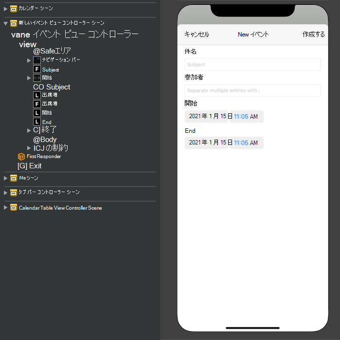
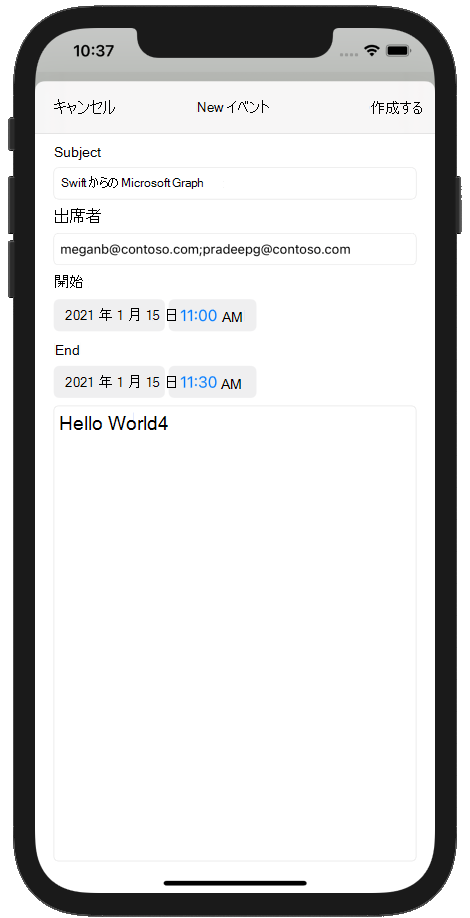

<!-- markdownlint-disable MD002 MD041 -->

このセクションでは、ユーザーの予定表にイベントを作成する機能を追加します。

1. **GraphManager.swift を** 開き、次の関数を追加して、ユーザーの予定表に新しいイベントを作成します。

    :::code language="swift" source="../demo/GraphTutorial/GraphTutorial/GraphManager.swift" id="CreateEventSnippet":::

1. **GraphTu touchl** **フォルダーに新** しい Cocoa Touch Class ファイルを作成します `NewEventViewController` 。 フィールド **のサブクラスで UIViewController** **を選択** します。
1. **NewEventViewController.swift を開き**、その内容を次の内容に置き換えてください。

    :::code language="swift" source="../demo/GraphTutorial/GraphTutorial/NewEventViewController.swift" id="NewEventViewControllerSnippet":::

1. **Main.storyboard を開きます**。 ライブラリを **使用して** 、ビュー **コントローラーをストーリーボード** にドラッグします。
1. ライブラリを **使用して**、ビュー **コントローラーにナビゲーション バー** を追加します。
1. ナビゲーション バーでタイトル **を** ダブルクリックし、次の値に更新します `New Event` 。
1. ライブラリを **使用** して、ナビゲーション バー **の** 左側にバー ボタン項目を追加します。
1. 新しいバー ボタンを選択し、属性インスペクター **を選択します**。 Title **を次に変更** します `Cancel` 。
1. ライブラリを **使用** して、ナビゲーション バー **の** 右側にバー ボタン項目を追加します。
1. 新しいバー ボタンを選択し、属性インスペクター **を選択します**。 Title **を次に変更** します `Create` 。
1. ビュー コントローラーを選択し、Id インスペクター **を選択します**。 クラス **を** **NewEventViewController に変更します**。
1. 次のコントロールをライブラリから **ビュー** に追加します。

    - ナビゲーション バー **の下にラベル** を追加します。 テキストを次に設定します `Subject` 。
    - ラベルの **下にテキスト フィールド** を追加します。 Placeholder 属性 **を次に設定** します `Subject` 。
    - テキスト フィールド **の下にラベル** を追加します。 テキストを次に設定します `Attendees` 。
    - ラベルの **下にテキスト フィールド** を追加します。 Placeholder 属性 **を次に設定** します `Separate multiple entries with ;` 。
    - テキスト フィールド **の下にラベル** を追加します。 テキストを次に設定します `Start` 。
    - ラベルの **下に日付の選択** コントロールを追加します。 [優先 **するスタイル] を** **[コンパクト] に** 設定し、**間隔****を 15 分** に設定し、高さを **35 に設定します**。
    - 日付の選択 **コントロールの** 下にラベルを追加します。 テキストを次に設定します `End` 。
    - ラベルの **下に日付の選択** コントロールを追加します。 [優先 **するスタイル] を** **[コンパクト] に** 設定し、**間隔****を 15 分** に設定し、高さを **35 に設定します**。
    - 日付の選択 **コントロールの下に** テキスト ビューを追加します。

1. 新しい **イベント ビュー コントローラーを選択し** 、 **接続インスペクターを使用して** 次の接続を行います。

    - 受信した **取り消** し操作を [キャンセル バー **] ボタンに** 接続します。
    - **createEvent 受信アクションを**[バーの作成]**ボタンに** 接続します。
    - 件名の **出口を** 最初のテキスト フィールドに接続します。
    - 出席者の **出口を 2** 番目のテキスト フィールドに接続します。
    - 最初の **日付の** 選択に開始の出口を接続します。
    - 最後の出口 **を** 2 番目の日付の選択に接続します。
    - 本文の **出口を** テキスト ビューに接続します。

1. 次の制約を追加します。

    - **ナビゲーション バー**
        - セーフ エリアへの先頭のスペース、値: 0
        - セーフ エリアへの末尾のスペース、値: 0
        - トップスペースからセーフ エリア、値: 0
        - 高さ、値: 44
    - **件名ラベル**
        - 表示余白への先頭のスペース、値: 0
        - ビューの余白への末尾のスペース、値: 0
        - ナビゲーション バーの上のスペース、値: 20
    - **[件名] テキスト フィールド**
        - 表示余白への先頭のスペース、値: 0
        - ビューの余白への末尾のスペース、値: 0
        - 件名ラベルの上のスペース、値: Standard
    - **出席者ラベル**
        - 表示余白への先頭のスペース、値: 0
        - ビューの余白への末尾のスペース、値: 0
        - 件名テキスト フィールドの上のスペース、値: Standard
    - **Attendees テキスト フィールド**
        - 表示余白への先頭のスペース、値: 0
        - ビューの余白への末尾のスペース、値: 0
        - 出席者ラベルの上のスペース、値: 標準
    - **開始ラベル**
        - 表示余白への先頭のスペース、値: 0
        - ビューの余白への末尾のスペース、値: 0
        - 件名テキスト フィールドの上のスペース、値: Standard
    - **開始日の選択**
        - 表示余白への先頭のスペース、値: 0
        - ビューの余白への末尾のスペース、値: 0
        - 出席者ラベルの上のスペース、値: 標準
        - 高さ、値: 35
    - **ラベルの終了**
        - 表示余白への先頭のスペース、値: 0
        - ビューの余白への末尾のスペース、値: 0
        - [開始日の選択] の上のスペース、値: 標準
    - **終了日の選択**
        - 表示余白への先頭のスペース、値: 0
        - ビューの余白への末尾のスペース、値: 0
        - トップスペースからエンド ラベル、値: Standard
        - 高さ: 35
    - **本文テキスト ビュー**
        - 表示余白への先頭のスペース、値: 0
        - ビューの余白への末尾のスペース、値: 0
        - トップスペースから終了日の選択、値: Standard
        - 表示余白の下のスペース、値: 0

    

1. 予定表シーン **を選択し**、接続インスペクタ **ーを選択します**。
1. **Triggered Segues の下** で、手動の横にある未入力の円をストーリーボードの新しいイベント ビュー **コントローラー** にドラッグします。 ポップアップ **メニューで [モーダルに** 表示] を選択します。
1. 追加したセグを選択し、属性インスペクターを **選択します**。 [識別子] **フィールドを** 次に設定します `showEventForm` 。
1. **showNewEventForm 受信アクションを** ナビゲーション バー ボタン **+** に接続します。
1. 変更内容を保存し、アプリを再起動します。 予定表ページに移動し、ボタンをタップ **+** します。 フォームに入力し、[作成] **をタップ** して新しいイベントを作成します。

    
